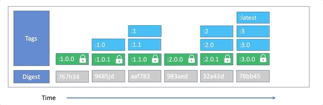

# Container Registry Digest Governance

## Key Concepts / Background
- One of the key concepts of Kabanero is to help teams come together to ensure that what is intended to be used for building applications is actually being used.  Applications and Application Stacks are designed to count on and leverage semver.org versions.  While the semver concept is great for understanding the meaning of tags as they are used throughout the lifecycle of applications and their base application stacks, semver itself, does not define any best practices for tagging containers in a container registry.  By design, container registries allow the same instance of a container (identified by a digest/sha256) can be labeled with one to many tags values.  While the container identifier (digest) is immuteable, the specific tags associated with that instance of the container can change over time.

- There are implications of the procedure Champ manages building and publishes application stacks for usage in Kabanero and the enterprise's container tagging strategy.  

### semver.org

- The software engineering community has published a de facto manifesto on semantic versioning. Essentially versions are limited to 3 digits(*):  `MAJOR.MINOR.PATCH`.  Changes to:

  - `PATCH` indicates the container contains fixes only, completely backwards compatible.
  - `MINOR` indicates the container contains new features, completely backwards compatible.
  - `MAJOR` indicates the container contains versions of features and software which may introduce deprecations and a withdrawl of features.  May not be backwards compatible.

(*) There are special rules if the `MAJOR` level of the version is `0` or if the `PATCH` level is suffixed with non-numeric characters. For more detail refer to [semver.org](https://semver.org).

 sermver.org adherence allows Kabanero the opportunity to provide features that take advantage of this disciplne, however Kabanero will not mandate a particular tagging policy.  

## User stories

- As a user of the Kabanero open upstream project, I would like to have documentation on the relationship between the application stack management and governance in my Kubernetes cluster and their underlying container registry digests and tags.

- As Champ (architect), I would like to be notified (warned) and/or view on the dashboard a notification that the digests of active application stacks have changed since activation.

- As Champ (architect), I would like to specify policy for actions to take when digest changes or mismatches are detected, e.g. if a build is attempted using an application stack whose digest is not active, I would like to be able to direct Kabanero to fail the build, warn or do nothing based on my enterprise's tagging strategy.

## As-is

- As of 0.6, a Kabanero pipeline step validates that the to-be built application has specified an application stack that is active.  This specification is made in the `.appsody-config.yaml` file of the to-be built repository, which is defined in the application stack.  The public stacks have specified a `MAJOR.MINOR` tag, however the form of the tag is configurable in the stack and established for new applications in the project directory by `appsody init`.   During the build step, the Kabanero validation logic reads the digest of the `MAJOR.MINOR` tag and ensures that an application stack version with that digest is active -- if not, a warning message is output in the pipeline run stream.  This behavior is less than ideal because it is notifying the developer in the pipeline run for builds instead of notifying operations.

## To-be

- Kabanero documents the best practice tagging for application stacks and their usage in Kabanero.

- Kabanero defines lifecycle digest mismatch detection points and governance actions.

- Kabanero unique experience dashboard extends views to examine applications built on the application stack.

Note: Specific scenario based examples are presented in the `Putting it all together` section below.

## Main Feature design

### Best practice semver container registry tagging

Having disciplne and defining policy for managing container registry tags is critical in ensuring that applications are built with the specific containers we expect.  Kabanero architecture is best leveraged using semver assignment of application stack container tags.  Study the following series of diagrams:

 

*Initial and Patch level added*

We can see the behavior of `latest`, `MAJOR`, `MAJOR.MINOR`, and `MAJOR.MINOR.PATCH` tags over time.  Notice that the `PATCH` level tags are locked, such that they will never be used to tag another container digest.  The `latest`, `1`, and `1.0` tags "float" to the latest semver patch level.  At the end of the time sequence, if one queries the container registry, `latest`, `1`, `1.0`, and `1.0.1` will all return the same digest.


*New Minor Release*

A new `MINOR` version has been published.  The `latest` and `MAJOR` tags are reassigned to the `1.1.0` container, and a new `MAJOR.MINOR` (`1.1`) tag is added to the new container.  Notice that the existing `1.0` tag remains assigned to `1.0.1` container. 


*New Major Release*

A new `MAJOR` version has been published.  The `latest` tags are reassigned to the `2.0.0` container, and new `MAJOR` and `MAJOR.MINOR` tags are also assigned to the container.


*New Patch Release*

A new patch level arrives for `2.0.0`.  The `latest`, `MAJOR` and `MAJOR.MINOR` tags are assigned to `2.0.1` container.


*New Major Release*

A new `MAJOR` version has been published.  The `latest` tags are reassigned to the `3.0.0` container, and new `MAJOR` and `MAJOR.MINOR` tags are also assigned to the container.



*New Patch for Prior Release*

Since the new container advances the `PATCH` level of `1.1`, and that `PATCH` is the latest semver release of `MAJOR` version `1`, both the `MAJOR` and `MAJOR.MINOR` tags are reassinged to the `1.1.1` container.  Notice that even though this container was published chronologically latest, the `latest` tag remains with the latest `PATCH` level of the latest `MAJOR.MINOR` release.

To net the discussion, tags:

- `latest`.  **Mutable**. Is assigned to the same container as latest `PATCH` level of the latest `MINOR` release of the latest `MAJOR` release.
- `MAJOR`.  **Mutable**. Is assigned to the latest `PATCH` level of the latest `MINOR` release of this major release.
- `MAJOR.MINOR`.  **Mutable**.  Is assigned to the latest `PATCH` level of this minor release.
- `MAJOR.MINOR.PATCH`.  **Immutable**. Is assigned to the specific container that is built providing the specific patch level.

### Application Stack Tags

To get the most out of Kabanero features, Kabanero design expects application stack tags to follow the semver tagging strategy documented above, although it is not strictly required.

Kabanero Stack configuration is driven with tags, the enterprise managing stack versions following semver.   When an application stack patch level is ready to be introduced to developers, we need to consider the need to configure Kabanero to activate the new patch level before new lifecycle events for applications built on that stack arrive in the managing Kubernetes cluster.  In otherwords, the new patch level should be activated before we try to build, deploy applications built on the new patch level.

As a best practice, the stacks included in the Kabanero stack-hub specify only the `MAJOR.MINOR` tags for identifying the application stack version this application depends.  This value, stored in the `.appsody-config.yaml` essentially declares that this application is not dependent on any specific `PATCH` level, only the feature set that is introduced and provided by the application stack at the `MAJOR.MINOR` level.  Using the tag lookup strategy documented previously, we can depend on the `MAJOR.MINOR` tag to point the latest released `PATCH` level.

Therefore, before we tag the newly minted `PATCH` level container with the `lastest`, `MAJOR`, and/or `MAJOR.MINOR` tags, we need to activate the stack semver patch level with the Kabanero operator.  Consider the case where Kabanero is configured with a given application stack version of `0.2.22`. In the container registry, the `latest`, `0` and `0.2` tags point at same patch level `0.2.22`.  Introducing a new patch level `0.2.23`, we update the `latest`, `0`, and `0.2` at the same time.  If a developer pushes an application update to GitHub that has specified `:0.2` tag in the project `.appsody-config.yaml` file.  The Kabanero managed pipeline executes, and it validates that the desired stack is active.  Looking up the `0.2` tag in the container registry, we'll find the same container tagged `0.2.23`, however Kabanero has not yet activated `0.2.23`.  In 0.6, Kabanero will issue warning messages in the pipeline run output, however this design looks to introduce new behaviors, such as fail the pipeline when this situation is detected.

When publishing a new patch level of an application stack container, a best practice is:

1. Build new application stack container and tag the container with its desired 3-digit semver tag.  In the example above, tag the container `0.2.23`.
1. Update the desired Kabanero deployments with the new single stack index to activate the new stack. 
1. Move the existing tags `latest`, `MAJOR` and `MAJOR.MINOR` to the new patch container, i.e. `0.2.23`
1. Rebuild the stack-hub index shared with developers to include the latest patch level
1. Kabanero build pipelines label application containers which identify which specific 3-digit semver application stack was used to build the application.  Query your container registry for containers that are built with the older patch level.
1. For each container, plan for rebuilding, testing and redeploying applications on the older patch level.

When retiring an older patch level of an application stack container, a best practice is:

1. Rebuild, test and redeploy all relevant applications built on the older patch level.
1. Remove application containers built on older patch level from the container registry
1. Remove old index from stack-hub index shared with developers.
1. Deactivate older patch level of application from Kabanero. (Referesh/Synchronize)
1. Remove old patch level of application stack container from the container regsitry.

### Compliance detection

Kabanero has various places during the lifecycle of applications and during its normal operation for which container digests can be examined to validate compliance with the semver best practices above.  Noting the possible detection locations, we can then assign actions based on configured policy at those decision points.

- **pre-build**.  Prior to executing the build pipeline tasks we validate whether the base application stack the application is being built with is activated.  The determination of "active" today is loosely based on tags.  In 0.6, we do examine the digest of the container tagged in `.appsody-config.yaml` and match that against the active container digests.

- **post-build**.  Although we've prevalidated the container digest was active prior to build, there is a time-of-check, time-of-use issue where the digest of the tag specified in `.appsody-config.yaml`.  It is possible that the container tag has been reassigned to a container with a different digest.  

- **pre-deploy**.  Prior to deploying an application the labels of the underlying base application stack can be examined for matches with active application stacks.

- **ad-hoc**.  Using the CLI and REST APIs (via Kabanero Unique Experience), the active application stacks version container digests can be interrogated to see if are the same as when the stack was activated.  The operator will store the digest of a given application stack version when it is first activated and update the status field of the Stack CR with the `digest-at-activation`.

### Governance actions

In the interest of being conservative related to introducing policy, since it is unclear whether integration with advanced policy frameworks might be desirable in the future, we simplify the choice of action.  These simple actions allow for easy configuration of consistent behavior accross stacks.  To simplify the configuration, we blend activation policy with digest mismatch policy.  Governance Action Policy:

**governance-policy: and stack-policy:**

A new field `governance-policy:` is added to the Kabanero CR with a subfield `stack-policy:`.  The `stack-policy:` subfield will specify one of the following policies, which will provide governance configuration for all stacks managed by Kabanero.

- **strict-digest**.  Indicates that usage of container tags for application stacks follow the strict guidelines as documented above, and as such, Kabanero will enforce that compliance by failing pipelines at the lifecycle point of detection.  `PATCH` tags are not expected to be assigned to different containers (in otherwords, they will always map to the same digest.)  Kabanero will provide validation that tags and digests are strictly adhering to the best practices and will fail pipelines where a digest violation has been detected or is not represented by an active application stack.

  The CLI and REST API, Kabanero User Experience will indicate digest mismatches.   The Kabanero operator will report digest mismatch detections for Stack version status.

  This policy is for use for teams that have their container tagging policy and activation procedures nailed down and expect to rigidly follow them; any digest mismatch represents a serious process problem and needs to be identified immediately.

- **active-digest**. (DEFAULT) Indicates that usage of container tags for application stacks follow the tagging best practices as documented above.  When Kabanero detects a digest mismatch, it substitutes a digest from an compatible active `PATCH` level within the same `MAJOR.MINOR`.  This policy  ensures that only application stacks that are activated are used to build applications. It also allows for a more flexible process for updating the container registry tags.  When Kabanero activates a version of an application stack, it stores its current digest in the Stack CR.  When Kabanero reaches a governance detection point, where there is a mismatch, Kabanero will interrogate the active stacks and determine the best active `PATCH` digest within the `MAJOR.MINOR` level. For example, if a build request occurs for `:2.0`, and the `:2.0` tag is bound to a container digest that is not active, Kabanero will look for active appliation stacks with the same `MAJOR.MINOR` tags and use the digest stored for the latest `PATCH` stack.

  The CLI and REST API, Kabanero user experience will indicate digest mismatches.  The Kabanero operator will report digest mismatch detections for Stack version status.

  This policy is default to allow the lowest friction onramp for developers and usage of the public stack hubs with Kabanero, especially in try it and demo scenarios.

- **ignore-digest**.  Kabanero still governs application stacks, but leveraging tags only.  Kabanero will ensure that a valid matching `PATCH` level is active at the governance detection points.  Kabnanero does not consider digests for governance decisions.  

  The CLI and REST API will not return digests.  The Kabanero operator will not process digests.

  This policy is useful for teams that do not have strict tagging policy for their containers, or have adopted tagging policy that makes other digest-centric governance policies painful.

- **none**.  Disables any stack active state, tag or digest validation.  Pipelines will be allowed to progress without any stack governance.

  The CLI and REST API will not return digests.  The Kabanero operator will not process digests.  

### Putting it all together

All of the examples of Kabanero policy enforcement will be based on a prepopulated container registry for a given application and Kabanero activated stack state:


_Container Registry Example_


_Kabanero Activated Stack State Example_

Example governance scenarios for build lifecycle detection points:

| tag | detection point | policy | action | digest |
|-----|-------|-----------|----------------|------|
| :latest | pre-build | strict-digest | build | 78bb45 |
|         |            | active-digest | build | 78bb45 |
|         |            | ignore-digest | build | 78bb45 |
|         |            | none | build | 78bb45 |
|         | post-build | strict-digest | keep | |
|         |            | active-digest | keep | |
|         |            | ignore-digest | keep | |
|         |            | none | keep | |

| tag | detection point | policy | action | digest |
|-----|-------|-----------|----------------|------|
| :1      | pre-build  | strict-digest | fail |  |
|         |            | active-digest | build | aaf783 |
|         |            | ignore-digest | build | 08cdef |
|         |            | none | build | 08cdef |
|         | post-build | strict-digest | discard |  |
|         |            | active-digest | keep | |
|         |            | ignore-digest | keep | |
|         |            | none | keep | |

| tag | detection point | policy | action | digest |
|-----|-------|-----------|----------------|------|
| :1.0    | pre-build  | strict-digest | build | 9485jd |
|         |            | active-digest | build | 9485jd |
|         |            | ignore-digest | build | 9485jd |
|         |            | none | build | 9485jd |
|         | post-build | strict-digest | discard | |
|         |            | active-digest | keep | |
|         |            | ignore-digest | keep | |
|         |            | none | keep | |

| tag | detection point | policy | action | digest |
|-----|-------|-----------|----------------|------|
| :1.1    | pre-build  | strict-digest | fail |  |
|         |            | active-digest | build | aaf783 |
|         |            | ignore-digest | build | 08cdef |
|         |            | none | build | 08cdef |
|         | post-build | strict-digest | discard | |
|         |            | active-digest | keep | |
|         |            | ignore-digest | keep | |
|         |            | none | keep | |

| tag | detection point | policy | action | digest |
|-----|-------|-----------|----------------|------|
| :1.1.1  | pre-build  | strict-digest | fail | n/a |
|         |            | active-digest | fail | n/a |
|         |            | ignore-digest | fail | n/a |
|         |            | none | build | 08cdef |
|         | post-build | strict-digest | discard | |
|         |            | active-digest | discard | |
|         |            | ignore-digest | discard | |
|         |            | none | keep | |

For life-cycle detection points after post build, the application is built on a specific 3-digit container.  Application stacks are labeled with a `dev.appsody.stack.version` label which indicates the stack build level. 

| tag | detection point | policy | action | 
|-----|-------|-----------|----------------|
| :1.1.0  | deploy      | strict-digest | deploy |
|         |             | active-digest | deploy |
|         |             | ignore-digest | deploy |
|         |             | none | build | deploy |


| tag | detection point | policy | action |
|-----|-------|-----------|----------------|
| :1.1.1  | deploy      | strict-digest | fail | 
|         |            | active-digest | fail | 
|         |            | ignore-digest | fail |
|         |            | none | deploy | 


### Custom Resource Changes

#### Kind:Kabanero

The Kabanero CRD will change to add a spec field `governancePolicy` with a subfield `stackPolicy` which will indicate either `strictDigest`, `activeDigest`, `ignoreDigest`, or `none`.  The default is `activeDigest`.

##### Kabanero CR Example
```
apiVersion: kabanero.io/v1alpha2
kind: Kabanero
metadata:
  name: kabanero
spec:
  stacks: 
    repositories: 
      - name: central
        https:
          url: https://github.com/kabanero-io/stacks/releases/download/0.6.0/index.yaml
          skipCertVerification: false  // default is false
      - name: incubator
        https:
          url: https://github.com/kabanero-io/stacks/releases/download/0.7.0/index.yaml
          skipCertVerification: false  // default is false
        pipelines:
          - id: default
            sha256: 0123456789abcdef
            https:
              url: https://github.com/kabanero-io/pipelines/releases/download/0.7.0/default.pipeline.tar.gz
              skipCertVerification: false    // default is false
    pipelines:
      - id: default
        sha256: 0123456789abcdef
        https:
          url: https://github.com/kabanero-io/pipelines/releases/download/0.6.0/default.pipeline.tar.gz
          skipCertVerification: false   // default is false
  governancePolicy:
    stackPolicy: strictDigest
  triggers:
    - id: default
      sha256: 0123456789abcdef
      https:
        url: https://github.com/kabanero-io/triggers/releases/download/0.7.0/default.triggers.tar.gz
        skipCertVerification: false   // default is false
```

#### Kind:Stack

The Stack CR has new status returned for each stack version that is active, indicating the container's digest at stack activation.  This can be found at `status.versions[x].images[y].digest.activation`.

### Kabanero Operator

The operator will store the digest of a given application stack version when it is first activated.  When the Stack CR is displayed, the current digest will read and will be added to the stack version status.

## Day 2 Operations

Not applicable.

### Kabanero Upgrade Scenarios

#### Kabanero 0.8 to 0.9

There are no configuration upgrade transformations known at this time.

#### (Kabanero 0.6 to 0.9

There are no configuration upgrade transformations known at this time.

#### (Kabanero updates from 0.1-0.5)

No support for directly upgrading from these releases.

##  Dependent Projects

### Appsody

Not applicable. 

## Kabanero Stacks

Not applicable.  

## Kabanero Pipelines

### Stack Publish Pipeline
A new stack build and publish pipeline is introduced, wired to an appsody stack repository.  This pipeline will demonstrate the best practice procedures for making the new release available for new applications.

### Pre-Build, Post-Build and Pre-Deploy Validation Steps

The pre-build and pre-deploy pipeline steps are enhanced to support the governance policy and act accordingly.  A new post-build step is produced to support the governance policy and act accordingly and added to the Kabanero default pipelines.

## Kabanero CLI and REST APIs

 The CLI and REST APIs are updated for Stack related Read methods to display active container status `digest-at-activation` (from the Stack CR) and `current-digest` value (from the container registry).

## Kabanero Guides

None.


## Kabanero Documentation

Tagging best practices and documentation describing the digest validation policy, actions and default behaviors.

## kabanero.io

Add content to `What's-new` blog.

## Kabanero Eventing Prototype

Kabanero eventing implements a digest validation detection point, and as such needs to follow the defined governance-policy.

#  - Other Considerations:  

#  - Discussion:  

