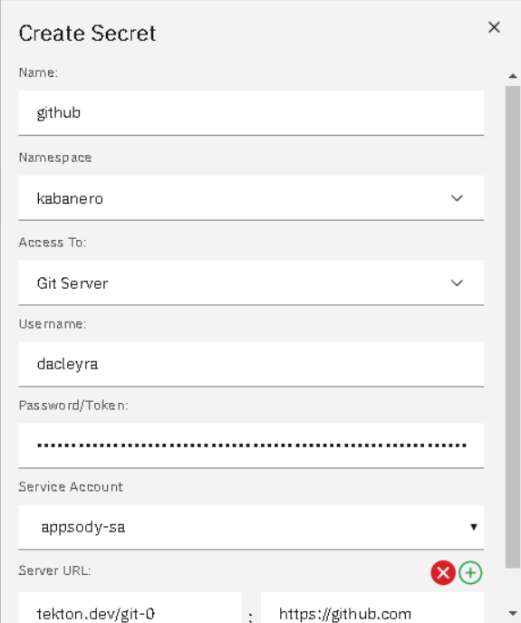
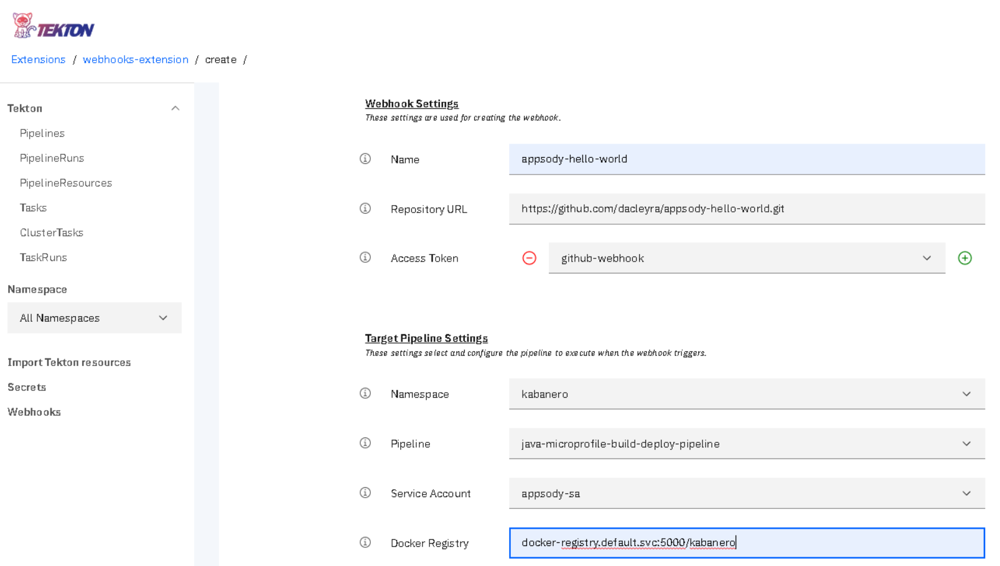
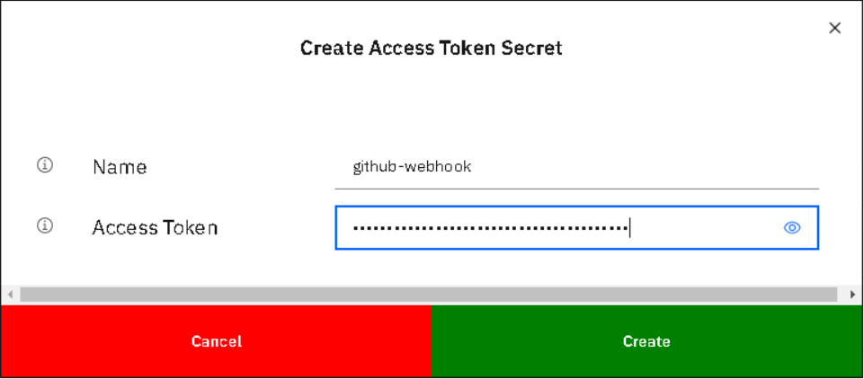

# Kabanero Foundation scripted install

## Prerequisites

* openshift_master_default_subdomain is configured
  * See more about [Configuring Your Inventory File](https://docs.okd.io/3.11/install/configuring_inventory_file.html)
* Wildcard DNS is available for your subdomain
  * alternatively, nip.io can be used
* The Internal Registry is configured
  * See more about the [Internal Registry](https://docs.okd.io/3.11/install_config/registry/index.html)

## Installation Scripts

Retrieve the [installation scripts from our documentation repository](https://github.com/kabanero-io/kabanero-foundation/tree/master/scripts)

## Installation

As a `cluster-admin`, execute the installation script, replacing `my.openshift.master.default.subdomain` with your subdomain:
```
openshift_master_default_subdomain=<my.openshift.master.default.subdomain> ./install-kabanero-foundation.sh
```

## Sample Appsody project with manual Tekton pipeline run

Create a Persistent Volume for the pipeline to use. A sample hostPath `pv.yaml` is provided.
```
oc apply -f pv.yaml
```

Create the pipeline and execute the example manual pipeline run
```
APP_REPO=https://github.com/dacleyra/appsody-hello-world/ ./appsody-tekton-example-manual-run.sh
```

By default, the application container image will be built and pushed to the Internal Registry, and then deployed as a Knative Service.

View manual pipeline logs
```
oc logs $(oc get pods -l tekton.dev/pipelineRun=appsody-manual-pipeline-run --output=jsonpath={.items[0].metadata.name}) --all-containers
```

Access Tekton dashboard at `http://tekton-dashboard.my.openshift.master.default.subdomain`

Access application at `http://appsody-hello-world.appsody-project.my.openshift.master.default.subdomain`


## Sample Appsody project with webhook driven Tekton pipeline run

Use appsody to create a sample project

1. Download [appsody](https://github.com/appsody/appsody/releases)
2. Add the kabanero collection repository to appsody `appsody repo add kabanero https://github.com/kabanero-io/collections/releases/download/v0.1.2/kabanero-index.yaml`
3. Initialize a java microprofile project `appsody init kabanero/java-microprofile`
4. Push the project to your github repository

Create a Persistent Volume for the tekton pipeline to use. A sample hostPath `pv.yaml` is provided.
```
oc apply -f pv.yaml
```

Create a priveleged service account to run the pipeline
```
oc -n kabanero create sa appsody-sa
oc adm policy add-cluster-role-to-user cluster-admin -z appsody-sa -n kabanero
oc adm policy add-scc-to-user hostmount-anyuid -z appsody-sa -n kabanero
```

Login to the Tekton dashboard using openshift credentials `http://tekton-dashboard.my.openshift.master.default.subdomain`

If your github repository is private, create a secret with your github credentials. Associate the secret with the service account that the pipeline will run as. 



Create a webhook using the dashboard, providing the necessary information. Provide the access token for creating a webhook.





Once the webhook is created, the dashboard generates a webhook in github. Verify the webhook is created by accessing.

https://github.com/YOURORG/appsody-hello-world/settings/hooks/

If the webhook payload was not successfully delivered, this may be due to a timeout of the webhook sink not starting in a timely manner. If so, select the failed webhook delivery in github, and redeliver it.

Trigger the pipeline.

Make a simple change to the application repository, such as updating the README.

In the Tekton dashboard, you should observe a new PipelineRun execute as a result of the commit and webhook.

## Uninstallation Scripts

A sample uninstall script is provided.  The script will perform the reverse of the install script.  Before running the uninstall script, consider removing any resources created outside of the install script (for example, webhooks, Knative services or Appsody applications).  Retrieve the [uninstallation scripts from our documentation repository](https://github.com/kabanero-io/kabanero-foundation/tree/master/scripts)

The sample uninstall script will completely remove all dependencies from the cluster, including Knative, Tekton and Istio.  The script can be modified if a different behavior is required.

## Uninstallation

As a `cluster-admin`, execute the sample uninstallation script:
```
./uninstall-kabanero-foundation.sh
```

